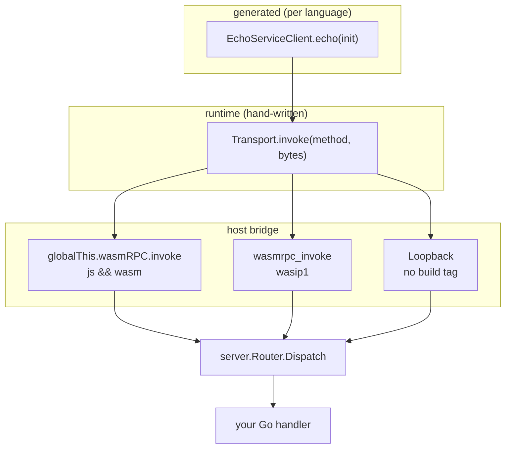

Every client in this repository is two layers: a narrow **byte-level transport**
and a **generated typed facade** that owns marshalling. Neither generated layer
knows anything about WebAssembly. That is why the same generated code works over
the browser bridge, over the WASI ABI, and over an in-process loopback in a Go
unit test.



## The three layers

<Steps>
  <Step title="Generated facade">
    Owns the Protobuf schema. Serializes the request, calls the transport with a
    method string and opaque bytes, deserializes the response. Produced by
    [`cmd/protogen-wasm`](/codegen/protogen-wasm).
  </Step>
  <Step title="Transport">
    Moves opaque bytes. Two operations only: a unary `invoke` and a streaming
    `listen`. Hand-written once per language in `client/<lang>`.
  </Step>
  <Step title="Router">
    `server.Router` maps a method string to a handler and runs it on a goroutine.
    Platform-neutral: no build tags, unit-testable under a native `go test`.
  </Step>
</Steps>

## Method names are opaque keys

The generator bakes `"<proto.package>.<Service>/<Method>"` into every client —
`internal/codegen/codegen.go:26-28` — and the router stores exactly that string
as a map key.

```go
// gen/go/ticker/v1/ticker_wasmrpc.pb.go:14
const TickerServiceSubscribeMethod = "ticker.v1.TickerService/Subscribe"
```

The router never parses these names. `server/router_test.go:21` registers a bare
`test/Panic` with no package segment and it routes fine. The dotted form is a
convention enforced by the generator, not by the runtime.

:::note
The wire identifier uses the **proto** method name (`m.Desc.Name()`), not the
generated Go name. A proto method `do_thing` produces the wire id
`pkg.v1.Service/do_thing` while the Go symbol is `DoThing`.
:::

## A name is unary or streaming, never both

Registration is exclusive and enforced at startup by a panic. `invoke`-ing a
streaming method — or `listen`-ing a unary one — is an `invalid_argument` error,
not a silent coercion.

| Mismatch                       | Code               | Message                                            |
| ------------------------------ | ------------------ | -------------------------------------------------- |
| `invoke` on a stream method    | `invalid_argument` | `server-streaming method: use listen, not invoke`  |
| `listen` on a unary method     | `invalid_argument` | `unary method: use invoke, not listen`             |

Sources: `server/router.go:88`, `server/stream.go:61`.

## The memory-boundary contract

The design goal is **exactly one copy per direction**, and no element-wise
`js.Value` traffic. Two independent `sync.Pool`s, both seeded at 4 KiB, carry
the buffers: `marshalPool` for responses and frames (`server/router.go:163-165`)
and `reqPool` for browser-inbound requests (`server/bridge.go:30-32`).

Inbound
: One `js.CopyBytesToGo` into a pooled buffer, grown with `make` only when
  `cap(buf) < n`.

Outbound
: `MarshalVT` when the message supports it, otherwise a pooled
  `proto.MarshalOptions{}.MarshalAppend`. Then one `js.CopyBytesToJS` into a
  fresh `Uint8Array`, then `RecycleResponse` returns the buffer to the pool.

:::warning[Borrowed bytes]
Payload slices handed to a `Handler` are valid **only for the duration of the
call** (`server/router.go:17-19`), and frame bytes passed to a `SendFunc` are
valid only during that send (`server/stream.go:12-15`). Typed handlers are
always safe because `proto.Unmarshal`/`UnmarshalVT` copy field data. Raw handlers
must not retain the slice.
:::

The same discipline is deliberately reproduced in-process:
`client/go/transport.go:41-43` deep-copies the loopback response and then calls
`server.RecycleResponse`, so a Go unit test exhibits the same aliasing behavior
as the real pooled bridge.

## The vtprotobuf fast path

`marshalMessage` and `unmarshalMessage` assert exactly two interfaces:

```go
// server/router.go:140-141
type vtMarshaler   interface{ MarshalVT() ([]byte, error) }
type vtUnmarshaler interface{ UnmarshalVT([]byte) error }
```

When both are present, protobuf reflection is bypassed entirely. There is no
`SizeVT` or `MarshalToSizedBufferVT` assertion anywhere in `server/`;
`MarshalAppend` is the reflection **fallback**, not an asserted interface.

This is a correctness requirement, not just an optimization: `reflect.NewAt`
inside `protobuf-go` crashes TinyGo. `buf.gen.yaml:8-10` therefore generates
`features=marshal+unmarshal+size` for every message by default.

## Backpressure differs per host

This is the one place where the two hosts genuinely diverge, and it matters when
you write a fast-producing handler.

| Host      | Model                | Buffer                     | Backpressure                          |
| --------- | -------------------- | -------------------------- | ------------------------------------- |
| Browser   | push                 | none — `onMessage` is called synchronously | **none** |
| wasip1    | pull                 | `make(chan uint64, 16)` (`server/wasip1.go:154`) | real — the handler blocks in `send` until the host calls `recv` |
| TS client | pull (`for await`)   | unbounded queue (`client/ts/src/client.ts:188-203`) | none — deferred to the protocol |

## Cancellation is not an error

`DispatchStream` returns `nil` when the handler errors **and** `ctx.Err() != nil`
(`server/stream.go:66-72`). A cancelled stream is normal termination.

Consequences you can rely on:

- The browser bridge fires `onEnd`, never `onError`, for a cancelled stream.
- The handler observes cancellation as `ctx.Done()` or a non-nil `Send` error.
- A unary call over the browser bridge is **not** cancellable at all: its context
  is `context.Background()` (`server/bridge.go`).

## Where to next

<CardGroup cols={2}>
  <Card title="Server API" href="/server" icon="server">
    `Router`, registration, dispatch, error codes.
  </Card>
  <Card title="Browser host" href="/hosts/browser" icon="globe">
    The `invoke`/`listen`/`cancel`/`methods` global.
  </Card>
  <Card title="WASI host" href="/hosts/wasip1" icon="cpu">
    The six `go:wasmexport` functions and the frame layout.
  </Card>
  <Card title="Codegen" href="/codegen" icon="wand">
    What each emitter produces, per language.
  </Card>
</CardGroup>
