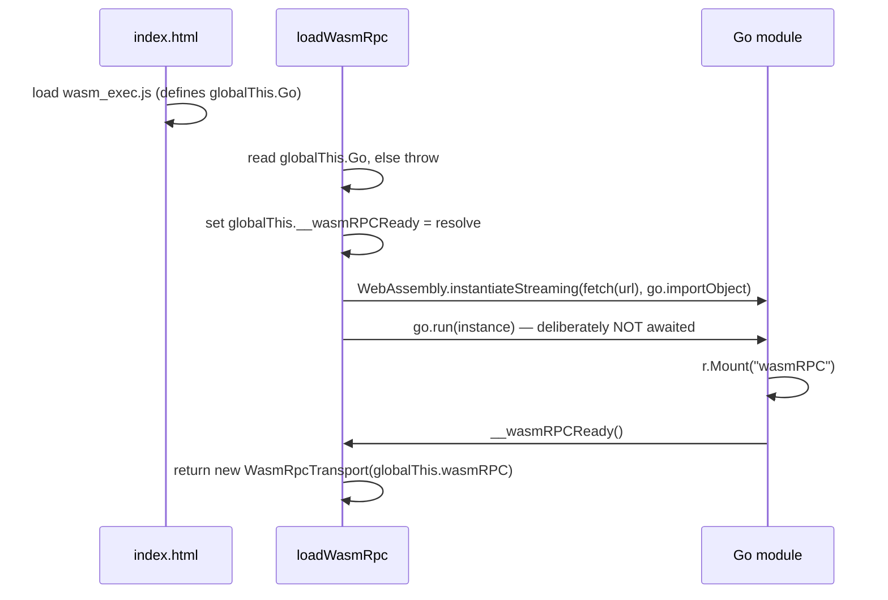

Built with `//go:build js && wasm` from `server/bridge.go` and
`server/bridge_stream.go`. `Router.Mount` exists only on this target.

## Mounting

```go title="Browser entrypoint"
//go:build js && wasm

func main() {
	r := server.NewRouter()
	echov1.RegisterEchoServiceServer(r, basic.New())
	r.Mount("wasmRPC")

	if ready := js.Global().Get("__wasmRPCReady"); ready.Truthy() {
		ready.Invoke()
	}
	select {} // keep the Go runtime alive
}
```

`select {}` is mandatory. `go.run(instance)` returns when `main` returns, and the
module would tear down before the first call.

The `__wasmRPCReady` invocation is the handshake with the TypeScript loader —
see [Bootstrapping](#bootstrapping) below.

## The mounted global

`Mount(globalName)` sets `js.Global()[globalName]` to an object with exactly four
keys (`server/bridge.go:42-56`):

```ts
globalThis[globalName] = {
  invoke(method: string, payload: Uint8Array): Promise<Uint8Array>,

  listen(
    method: string,
    payload: Uint8Array,
    handlers: {
      onMessage(m: Uint8Array): void,   // required, must be a function
      onError?(e: Error): void,
      onEnd?(): void,
    },
  ): number,                            // stream id >= 1, or 0 on failure

  cancel(id: number): void,
  methods(): string[],
};
```

## Stream ids

Ids come from a single global registry (`server/bridge_stream.go:19-23`) holding
`next uint32` and `cancels map[uint32]context.CancelFunc`. That design exists so
`cancel` can be **one persistent `js.Func`** — there are no per-stream `js.Func`
allocations to leak.

Ids are pre-incremented (`streamReg.next++`, then `id := streamReg.next`), so a
valid id is always `>= 1`. That makes **`0` an unambiguous failure sentinel**.

`cancel` is idempotent: it silently returns `undefined` on wrong arity, a
non-number argument, or an unknown id (`server/bridge_stream.go:117-120`).

## How `listen` reports failure

Dual-mode, and worth knowing before you write a host:

- If `args` has length 3 **and** `handlers.onError` is a function, the error is
  delivered by invoking `onError(errToJS(e))` and `listen` **returns `0`**.
- Otherwise it panics with a `js.Error`, which surfaces as a **thrown** JS Error
  from the `listen` call itself.

So a caller that supplies `onError` never sees a throw, and a caller that omits
it always does.

## Panics

A recovered panic becomes an `internal` error. The stack goes to the console
only, never to application code:

```
console.error("[wasm-rpc] " + method + " panicked:\n" + detail)
```

Emitted at `server/bridge.go:101` and `server/bridge_stream.go:101`, and only
when `detail != ""` — i.e. only for recovered panics, never for a handler that
returned `server.Errorf`.

## Memory path

Exactly one copy per direction, and no element-wise `js.Value` traffic.

<Steps>
  <Step title="Inbound">
    Read `payload.byteLength`, take a buffer from `reqPool`, grow it with `make`
    only when `cap(buf) < n`, then a single `js.CopyBytesToGo`. A short copy is
    an `internal` error, not a silent truncation.
  </Step>
  <Step title="Handler">
    Runs on a fresh goroutine inside the Promise executor, so the JS event loop
    never blocks. The executor's `js.Func` is `Release()`d via defer.
  </Step>
  <Step title="Outbound">
    `uint8ArrayCtor.New(len(out))`, one `js.CopyBytesToJS`, then
    `RecycleResponse(out)` returns the buffer to `marshalPool`, then
    `resolve.Invoke(u8)`.
  </Step>
</Steps>

Streaming `send` follows the same outbound path but is **push-based, synchronous,
and unbuffered** (`server/bridge_stream.go:85-93`) — `onMessage.Invoke(u8)` is
called directly from the handler goroutine. There is no backpressure on the
browser path.

:::warning[Unary calls cannot be cancelled]
The context handed to `Dispatch` is `context.Background()`. The global exposes no
way to abort an in-flight `invoke`. Only streams have `cancel(id)`.
:::

## Bootstrapping

`loadWasmRpc` (`client/ts/src/client.ts:59`) is the supported browser
entrypoint. The sequence is a handshake, not a poll:



Two failure messages you will actually hit:

| Cause                                          | Thrown message                                          |
| ---------------------------------------------- | ------------------------------------------------------- |
| `wasm_exec.js` not loaded, or loaded too late  | `wasm_exec.js not loaded: global Go class is missing`   |
| entrypoint forgot `r.Mount(...)`               | `Go module ran but did not mount globalThis.wasmRPC`    |

Both are plain `Error`s, not `WasmRpcError`s.

:::note[Load order]
`wasm_exec.js` must be a **classic** script in `<head>`, before the module
script. `examples/web-echo/index.html` does exactly this. A module script would
be deferred and `Go` would be undefined when the app's `useEffect` runs.
:::

Because `loadWasmRpc` uses `instantiateStreaming`, the `.wasm` file must be
served with `Content-Type: application/wasm`. Vite's static handler does this for
files in `public/` by default — no MIME plugin is configured in either example's
`vite.config.ts`, and none is needed. No COOP/COEP headers are set either;
nothing here uses `SharedArrayBuffer`.

## Bypassing the loader

Any non-browser host can instantiate the module itself and wrap the mounted
global directly. This is what the Node harness does:

```js title="examples/e2e/e2e.mjs:27-39"
const go = new Go();
const { instance } = await WebAssembly.instantiate(
  readFileSync(wasmModule),
  go.importObject,
);
void go.run(instance);
await ready; // resolved by __wasmRPCReady

const transport = new WasmRpcTransport(globalThis.wasmRPC);
```

Note `WebAssembly.instantiate`, not `instantiateStreaming` — there is no `fetch`
or MIME type in Node.

## TinyGo

Pair a TinyGo browser module with **TinyGo's own** `wasm_exec.js`, not Go's:

```sh
tinygo build -target=wasm -no-debug -o app.wasm ./examples/e2e/wasm
# glue lives at $(tinygo env TINYGOROOT)/targets/wasm_exec.js
```

`make test-e2e-tinygo` sets `WASM_EXEC_JS` accordingly and passes `SKIP_PANIC=1`
because TinyGo cannot `recover()` on wasm. See [TinyGo](/tinygo).
