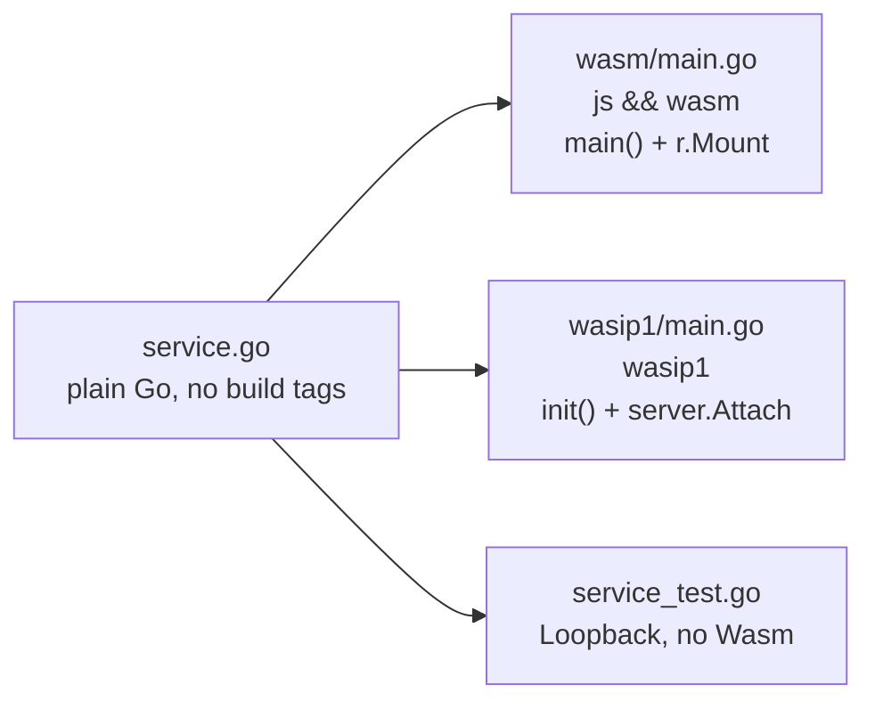

Every example follows the same three-layer shape. The service package carries **no
build tags**, so one implementation serves native tests, the browser, and WASI.



## The entrypoint difference

This table is the whole delta between the two hosts.

|                   | Browser (`js && wasm`)                   | WASI (`wasip1`)                              |
| ----------------- | ---------------------------------------- | -------------------------------------------- |
| build tag         | `//go:build js && wasm`                  | `//go:build wasip1`                          |
| build flags       | `GOOS=js GOARCH=wasm`                    | `GOOS=wasip1 GOARCH=wasm -buildmode=c-shared`|
| registration site | `func main()`                            | `func init()`                                |
| publish call      | `r.Mount("wasmRPC")`                     | `server.Attach(r)`                           |
| liveness          | `__wasmRPCReady()` then `select {}`      | `func main() {}`; host calls `_initialize`   |

## `server-basic` — minimal unary

Two unary methods on `echo.v1.EchoService`, plus reusable `wasm` and `wasip1`
binaries.

```go
func (s *Service) Echo(_ context.Context, req *echov1.EchoRequest) (*echov1.EchoResponse, error)
func (s *Service) Reverse(_ context.Context, req *echov1.ReverseRequest) (*echov1.ReverseResponse, error)
```

`Echo` rejects `repeat > 1000` with a typed `invalid_argument`. `Reverse` reverses
over `[]rune`, so multi-byte UTF-8 survives the boundary.

```sh
cd examples/server-basic
make wasm            # bin/server.wasm + bin/wasm_exec.js
make wasm-tinygo
make wasip1          # bin/server.wasip1.wasm
make wasip1-tinygo
make test            # loopback round-trip, no Wasm
make clean
```

`make test` runs `TestGeneratedClientLoopback`: `Echo{"hi", repeat: 2}` yields
`"hihi"`, `Reverse("abc")` yields `"cba"`, and `repeat: 9999` yields a
`*wasmrpcclient.Error` with code `invalid_argument`.

## `server-streaming` — reference server stream

One server-streaming method on `ticker.v1.TickerService`, with deliberate
behaviors so the harnesses have something to assert against.

```go
func (s *Service) Subscribe(
	ctx context.Context,
	req *tickerv1.SubscribeRequest,
	stream *server.ServerStream[*tickerv1.SubscribeResponse],
) error
```

| Input                | Behavior                                     |
| -------------------- | -------------------------------------------- |
| `count == 0`         | defaults to `3`                              |
| `count > 10000`      | `invalid_argument`                           |
| `interval_ms == 0`   | defaults to `1ms`                            |
| `interval_ms > 10s`  | `invalid_argument`                            |
| `topic == "explode"` | panics deliberately                          |

Same five Make targets. `make test` runs four loopback tests:

<Steps>
  <Step title="TestStreamLoopback">Three frames, sequence ends at 3.</Step>
  <Step title="TestStreamCancelViaCallback">
    The callback returns a sentinel at frame 2; `errors.Is` matches and exactly
    two frames arrived.
  </Step>
  <Step title="TestStreamPanicIsInternal">
    Topic `"explode"` yields code `internal`.
  </Step>
  <Step title="TestStreamTypedError">
    `count: 99999` yields code `invalid_argument`.
  </Step>
</Steps>

## `web-echo` and `web-streaming` — Vite + React

Both reuse the sibling service packages verbatim, proving the service layer is
entrypoint-agnostic.

```sh
make -C examples/web-echo dev        # unary demo
make -C examples/web-streaming dev   # streaming demo with a cancel button
```

`make dev` chains everything: build `public/server.wasm`, build
`client/ts/dist` (the npm dep is `file:../../client/ts`, so `dist/` must exist
first), `npm install`, then `vite`.

| Target                    | Effect                                                        |
| ------------------------- | ------------------------------------------------------------- |
| `make server`             | `public/server.wasm` + `public/wasm_exec.js` (big Go)          |
| `make server-tinygo`      | same, TinyGo, paired with TinyGo's own `wasm_exec.js`          |
| `make client`             | `cd ../../client/ts && npm install && npm run build`           |
| `make install`            | `client` + `npm install`                                      |
| `make dev` / `build` / `preview` | Vite dev / production build / preview                  |
| `make clean`              | removes `node_modules`, `dist`, and the two `public/` artifacts |

:::note[No special server config]
Both `vite.config.ts` files are exactly `defineConfig({ plugins: [react()] })`.
No port is configured, so the dev server is Vite's default
`http://localhost:5173` (a second concurrent instance falls back to 5174). No
COOP/COEP headers — nothing uses `SharedArrayBuffer`. No wasm MIME plugin —
Vite already serves `public/*.wasm` as `application/wasm`, which
`instantiateStreaming` requires.
:::

`public/` does **not** exist in a fresh clone; it is gitignored and created by
`make server`.

### What the unary demo shows

`client.echo({message, repeat})` and `client.reverse({message})`, a "Trigger typed
error" button sending `repeat: 5000`, and `transport.methods()` rendered so you can
see what the router registered. Errors are narrowed with
`e instanceof WasmRpcError`.

### What the streaming demo shows

`client.subscribe({topic, count, intervalMs})` returns a stream **synchronously**;
it is stashed in a `useRef` and consumed with `for await`. The Cancel button —
disabled unless streaming — calls `streamRef.current?.cancel()`. A "Trigger handler
panic" button sets topic `"explode"` to surface an `internal` error.

The status union is `idle | streaming | done | cancelled | error`, and the
post-loop transition is guarded:

```ts
setStatus((s) => (s === "streaming" ? "done" : s));
```

Without that guard, the normal loop exit after a cancel would overwrite
`cancelled` with `done`.

## `examples/e2e` — Node harness over the browser ABI

Registers **both** services on one router. Driven by the root Makefile; it has no
Makefile of its own.

| Env var        | Default                        | Purpose                              |
| -------------- | ------------------------------ | ------------------------------------ |
| `WASM_EXEC_JS` | `examples/e2e/wasm_exec.js`    | which glue script to load            |
| `WASM_MODULE`  | `examples/e2e/app.wasm`        | which module to instantiate          |
| `SKIP_PANIC`   | unset                          | skips the panic test when exactly `"1"` |

It uses `WebAssembly.instantiate` on file bytes, not `instantiateStreaming` —
there is no `fetch` or MIME type in Node — and imports the **compiled** clients
from `client/ts/dist`, so `make ts` is a prerequisite.

Eleven assertion blocks:

1. `methods()` sorted equals the three expected names
2. `echo({message:"hyp", repeat:3})` yields `"hyphyphyp"` and `unixMillis > 0`
3. `reverse("héllo🚀")` yields `"🚀olléh"` — rune safety across the boundary
4. `repeat: 5000` rejects `invalid_argument`
5. an unknown method rejects `unimplemented`
6. raw `invoke(..., "not bytes")` rejects `invalid_argument` without crashing
7. `for await` over `subscribe({count:4})` yields seqs `[1,2,3,4]`
8. `cancel()` after two frames of a 50-frame stream stops it early
9. topic `"explode"` rejects `internal` — **skipped** under `SKIP_PANIC=1`
10. both misuse directions reject `invalid_argument` rather than hanging
11. the module is still alive afterwards

Banner: `E2E PASS: 11/11`, or `10/10 (panic-recovery skipped: TinyGo)`.

```sh
make test-e2e          # big Go
make test-e2e-tinygo   # TinyGo, SKIP_PANIC=1
```

## `examples/e2e/wasip1host` — wazero host over the WASI ABI

A **separate Go module** requiring `wazero v1.9.0`, with
`replace github.com/prdlk/wasm-rpc => ../../..`. Keeping it separate is why wazero
never becomes a dependency of the library.

It exercises `wasmrpc_alloc`, `wasmrpc_free`, `wasmrpc_invoke`,
`wasmrpc_stream_open`, and `wasmrpc_stream_recv` directly, unpacking
`ptr<<32|len` and reading `[status u8][payload]` frames. Five assertions: unary
round-trip, typed error, a four-frame stream, panic recovery (skippable), and
module survival.

```sh
make test-wasip1          # 5/5 via wazero
make test-wasip1-tinygo   # 4/4, --skip-panic
```

See [WASI host](/hosts/wasip1) for the full ABI it drives.

## What is generated vs committed

`.gitignore` tells you what a fresh clone lacks:

```
node_modules/  build/  bin/  dist/  client/ts/dist/
examples/e2e/app.wasm            examples/e2e/wasm_exec.js
examples/web-echo/public/server.wasm         (+ wasm_exec.js)
examples/web-streaming/public/server.wasm    (+ wasm_exec.js)
*.tsbuildinfo
```

So `examples/web-*/public/` and `examples/server-*/bin/` do not exist until you
run `make server` / `make wasm`. Conversely `gen/` and `client/ts/gen/` **are**
committed — even though `make clean` deletes them.
