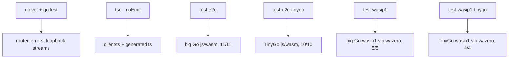

## Prerequisites

| Tool   | Version           | Source        |
| ------ | ----------------- | ------------- |
| Go     | >= 1.24           | `go.mod:3`    |
| buf    | >= 1.50           | `Makefile:3`  |
| Node   | >= 20             | `Makefile:3`  |
| TinyGo | >= 0.34, optional | `Makefile:3`  |

`protoc-gen-go` must be installed. `protoc-gen-es` comes from
`client/ts/node_modules` (run `npm install` in `client/ts`).
`protoc-gen-go-vtproto` runs via the `go.mod` `tool` directive — nothing to
install. Dart, Kotlin, and Swift stubs come from BSR remote plugins, so those
toolchains are not needed for codegen.

## Root module

```
module github.com/prdlk/wasm-rpc

go 1.24

require google.golang.org/protobuf v1.36.5
require github.com/planetscale/vtprotobuf v0.6.0

tool github.com/planetscale/vtprotobuf/cmd/protoc-gen-go-vtproto
```

Exactly two requires and one tool directive. No `toolchain` line. `go.sum` pins
four modules. Note that **wazero is absent** — the wazero host lives in its own
module under `examples/e2e/wasip1host`.

## Targets

### Schema

```sh
make lint        # buf lint
make generate    # buf generate — twelve outputs in one pass
make breaking    # buf breaking --against '.git#branch=main'
```

### Build

```sh
make wasm            # GOOS=js GOARCH=wasm      -> examples/e2e/app.wasm + wasm_exec.js
make wasm-tinygo     # tinygo -target=wasm      -> build/app.tinygo.wasm
make wasip1          # GOOS=wasip1 -buildmode=c-shared -> build/e2e.wasip1.wasm
make wasip1-tinygo   # tinygo -target=wasip1    -> build/e2e.tinygo.wasip1.wasm
make ts              # tsc -p client/ts/tsconfig.json -> client/ts/dist
```

All Wasm builds use `-trimpath -ldflags="-s -w"`. `wasm_exec.js` is resolved from
`GOROOT` with a wildcard covering both layouts — `misc/wasm` on Go `<= 1.23` and
`lib/wasm` on Go `>= 1.24`.

### Verify

```sh
make test                  # go vet ./... && go test ./... && tsc --noEmit
make test-e2e              # 11 asserts, big Go browser module under Node
make test-e2e-tinygo       # 10 asserts, TinyGo module, SKIP_PANIC=1
make test-wasip1           # 5 asserts, wazero host driving go:wasmexport
make test-wasip1-tinygo    # 4 asserts, TinyGo guest, --skip-panic
```

Each E2E target declares its build prerequisites, so `make test-e2e` builds
`wasm` and `ts` first.

### Dev

```sh
make serve   # prints the two example dev-server commands
make clean
```

`make serve` does not start anything — it echoes:

```
make -C examples/web-echo dev
make -C examples/web-streaming dev
```

## `make clean` is destructive

```sh
rm -rf gen client/ts/gen client/ts/dist client/dart/lib/gen \
	client/kotlin/gen client/swift/Sources/WasmRpcGen/echo \
	client/swift/Sources/WasmRpcGen/ticker build \
	examples/e2e/app.wasm examples/e2e/wasm_exec.js
```

:::danger[It deletes committed files]
`gen/`, `client/ts/gen/`, `client/dart/lib/gen/`, `client/kotlin/gen/`, and the
two Swift gen directories are **committed to the repository**. `make clean` removes
them, leaving the working tree dirty and `go test ./...` unable to compile —
`server/router_test.go` imports `gen/go/echo/v1` directly.

Always follow `make clean` with `make generate`.
:::

## The full verification matrix



### Verified

| Area                              | How                                                        |
| --------------------------------- | ---------------------------------------------------------- |
| Router dispatch, panics, errors   | `server/router_test.go`, five tests                        |
| Streaming, cancel, panic, typed error | `examples/server-streaming/service_test.go`, four loopback tests |
| Generated Go client               | `examples/server-basic/service_test.go` over `Loopback`     |
| Browser ABI, big Go               | `make test-e2e`, 11/11 through a real `.wasm`               |
| Browser ABI, TinyGo               | `make test-e2e-tinygo`, 10/10                               |
| WASI ABI, big Go                  | `make test-wasip1`, 5/5 under wazero                        |
| WASI ABI, TinyGo                  | `make test-wasip1-tinygo`, 4/4                              |
| TypeScript types                  | `tsc --noEmit` over `src/` and `gen/`                       |
| Schema hygiene                    | `buf lint` with `STANDARD`, plus `buf generate` incl. BSR   |

### Not verified

:::warning
Dart, Kotlin, and Swift are **never compiled** in this repository. The evidence is
unambiguous:

- `make test` runs only `go vet`, `go test`, and `tsc --noEmit`.
- The `.PHONY` list contains no `dart`, `kotlin`, `swift`, or `jvm` target; the
  only client build target is `ts`.
- Kotlin has no Gradle wrapper — no pinned distribution, no reproducible build.
- Swift has no test target and no `Package.resolved`.
- Dart has no `dev_dependencies` and no `analysis_options.yaml`.

Those three languages appear in the Makefile in exactly two places: the prereq
comment noting BSR plugins need no local toolchain, and `clean` deleting their
generated directories.

Add `dart analyze`, a Gradle build, and `swift build` to your own CI before
depending on them.
:::

Also untested anywhere: the registration-duplicate panics, and
`Router.Methods()` ordering (only its *contents* are asserted, after sorting).

## Continuous integration

This documentation site ships a GitHub Actions workflow at
`.github/workflows/docs.yml` that builds the docs with Blume and publishes them to
GitHub Pages. It does **not** run the Go or TypeScript suites — a docs-only change
should not wait on a Wasm toolchain, and a code change should not be gated on the
docs build.

If you add a code CI workflow, the minimum useful set is:

```yaml
- run: make lint generate
- run: git diff --exit-code   # generated code is committed; catch drift
- run: make test
- run: make test-e2e
- run: make test-wasip1
```

The `git diff --exit-code` step matters precisely because `gen/` is committed: it
catches a `.proto` edit that was never regenerated.

TinyGo targets need a TinyGo installation; gate them behind a separate job so the
main pipeline stays fast.
