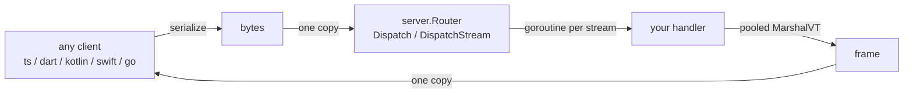

`wasm-rpc` compiles your Go service into a WebAssembly module and gives every
caller a typed, generated client. There is no HTTP server, no port, and no
network hop — the client serializes a Protobuf message, hands the bytes across
the Wasm boundary exactly once, and a Go handler runs on a goroutine.

Two RPC kinds are supported: **unary** and **server-streaming**. Client- and
bidi-streaming are deliberately unsupported and are skipped by the code
generator in every language.



## Two hosts, one router

The `server` package splits into a platform-neutral core and two host bridges.
The core — `Router`, `ServerStream`, `Error` — carries no build tags and runs
under a plain `go test`. Each bridge is tag-gated and exposes the same router
through a host-native ABI.

<CardGroup cols={2}>
  <Card title="Browser" href="/hosts/browser" icon="globe">
    `//go:build js && wasm`. `Router.Mount("wasmRPC")` installs a JS global with
    `invoke`, `listen`, `cancel`, and `methods`.
  </Card>
  <Card title="WASI" href="/hosts/wasip1" icon="cpu">
    `//go:build wasip1`. `server.Attach(r)` from `init()` exposes six
    `go:wasmexport` functions to any WASI host.
  </Card>
</CardGroup>

## What you write, what is generated

You write a `.proto` file and a Go handler. `buf generate` produces everything
else in one pass — message stubs for five languages plus wasm-rpc bindings from
the first-party plugin `cmd/protogen-wasm`.

```go title="Your service, any target"
r := server.NewRouter()
echov1.RegisterEchoServiceServer(r, echo.New())
r.Mount("wasmRPC")        // browser
// or: server.Attach(r)   // wasip1 reactor, from init()
```

```ts title="Your caller, TypeScript"
const transport = await loadWasmRpc("/server.wasm");
const client = new EchoServiceClient(transport);
const res = await client.echo({ message: "hi", repeat: 2 });
```

## Per-language shape

The generator maps each RPC kind onto the idiomatic async primitive of the
target language, so nothing feels bolted on.

| Language   | Unary                     | Server stream                        |
| ---------- | ------------------------- | ------------------------------------ |
| Go         | `(ctx, req) (resp, error)` | `Subscribe(ctx, req, fn)` callback   |
| TypeScript | `Promise<Resp>`           | `AsyncIterable<Resp>` + `cancel()`   |
| Dart       | `Future<Resp>`            | `Stream<Resp>`                       |
| Kotlin     | `suspend fun`             | `Flow<Resp>`                         |
| Swift      | `async throws`            | `AsyncThrowingStream<Resp, Error>`   |

Each runtime, and which of them are actually compiled here, is covered in
[Clients](/clients).

## Why TinyGo matters

The runtime avoids protobuf reflection whenever a message implements
vtprotobuf's `MarshalVT`/`UnmarshalVT` — generated by default in this repo.
That is not only a speed win: `reflect.NewAt` inside `protobuf-go` crashes
TinyGo, so the vt fast path is what makes a TinyGo build viable at all.

|                         | big Go   | TinyGo 0.38 |
| ----------------------- | -------- | ----------- |
| browser module size     | ~6.4 MB  | **~1.2 MB** |
| wasip1 module size      | ~6.4 MB  | **~1.1 MB** |
| unary + streams + cancel | ✅       | ✅          |
| panic → `internal` error | ✅       | ❌ aborts   |

See [TinyGo](/tinygo) for the constraints this imposes on handler code.

## Start here

<CardGroup cols={2}>
  <Card title="Quickstart" href="/quickstart" icon="rocket">
    Generate, build, and call a service end to end.
  </Card>
  <Card title="Architecture" href="/architecture" icon="layers">
    How a call travels from client to handler and back.
  </Card>
  <Card title="Server API" href="/server" icon="server">
    `Router`, registration, dispatch, and error codes.
  </Card>
  <Card title="Codegen" href="/codegen" icon="wand">
    The buf v2 pipeline and what `protogen-wasm` emits.
  </Card>
  <Card title="Clients" href="/clients" icon="plug">
    Five runtimes, and which ones are verified.
  </Card>
  <Card title="Build & verify" href="/build-and-verify" icon="hammer">
    Every Make target and what each one proves.
  </Card>
</CardGroup>
